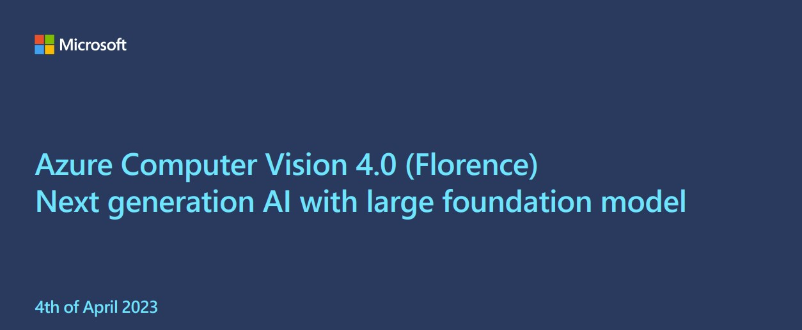

# Azure Computer Vision in a day workshop

> In this technical workshop, you will receive a thorough introduction to **Azure Computer Vision** and **Azure Vision Studio**. You will be taught how to utilize the new capabilities of Azure Computer Vision 4 to analyze images, including its **multimodal features (Florence)**.
Moreover, you will be able to investigate pre-existing solution accelerators and best practices for prototyping and deploying end-to-end use cases. Finally, the workshop will conclude with a Q&A session and a wrap-up.

Note: Some of these new features are currently in ***public preview.***  
https://learn.microsoft.com/en-us/azure/cognitive-services/computer-vision/

## 1. Workshop agenda
### 🌅 Morning (9:00 – 12:00) 
Focus: Introduction and images processing with Azure Computer Vision  
📣 Azure Computer Vision presentation (30 mins) 
📣 Azure Azure Vision Studio (30 mins) 
📣 Intro Workshop (15 mins) 
🧑🏼‍💻 Azure Computer Vision setup (15 mins) 
🧑🏼‍💻 Image Analysis using Azure Computer Vision  (15 mins) 
Pause (20 min) 
🧑🏼‍💻 Dense captioning of images  (15 mins) 
🧑🏼‍💻 Background removal with Azure Computer Vision  (15 mins) 
🧑🏼‍💻 Gradio webapp example using the background removal from Azure Computer Vision  (10 mins) 
🧑🏼‍💻 Image retrieval with Azure Computer Vision (images et text vectors embeddings)  (15 mins) 

### 🌆 Afternoon (14:00 – 17:00) 
Focus: Visual search usecase with Azure Computer Vision 
 
📣 Recap (15 mins) 
🧑🏼‍💻 Fashion visual search - Images analysis (45 mins) 
🧑🏼‍💻 Fashion visual search - Images embeddings (60 mins) 
🧑🏼‍💻 Fashion visual search - Search using an image or a prompt (15 mins) 
🧑🏼‍💻 Fashion visual search - Images Clustering (15 mins) 
QnA session (30min) 
 
Legend: 📣 Presentation, 🧑🏼‍💻 Hands-on lab

## 2. Notebooks
### Azure Computer Vision setup
<a href="00 Setup Azure Computer Vision.ipynb">00 Setup Azure Computer Vision</a>

### Image Analysis using Azure Computer Vision
<a href="01 Image Analysis.ipynb">01 Image Analysis</a>

### Dense captioning of images
<a href="02 Captioning and dense captioning.ipynb">02 Captioning and dense captioning</a>

### Background removal with Azure Computer Vision
<a href="03 Background removal.ipynb">03 Background removal</a>

### Gradio webapp example using the background removal from Azure Computer Vision
<a href="04 Gradio app for background removal.ipynb">04 Gradio app for background removal</a>

### Image retrieval with Azure Computer Vision (images et text vectors embeddings)
<a href="05 Image retrieval.ipynb">05 Image retrieval</a>

### Visual Search demo based on a fashion images datasets using Azure Computer Vision
<a href="06 Fashion visual search - Images analysis.ipynb">06 Fashion visual search - Images analysis</a>

### Visual Search demo (images vectors embeddings)
<a href="07 Fashion visual search - Images embeddings.ipynb">07 Fashion visual search - Images embeddings</a>

### Visual Search demo (Search using an image reference or a text)
<a href="08 Fashion visual search - Search using an image or a prompt.ipynb">08 Fashion visual search - Search using an image or a prompt</a>

### Visual Search demo (images clustering using images vectors embeddings)
<a href="09 Fashion visual search - Images Clustering.ipynb">09 Fashion visual search - Images Clustering</a>

Note: You need to enter your Azure Computer vision endpoint and key in these two .env files:
<a href=azure.env>azure.env</a>
<a href=visualsearch.env>visualsearch.env</a>

## 3. Azure Computer Vision presentation
<a href="Azure Computer Vision 4.pdf">Azure Computer Vision PowePoint presentation</a>

## 4. Documentation
https://learn.microsoft.com/en-us/azure/cognitive-services/computer-vision/

## 5. Vision Studio
https://portal.vision.cognitive.azure.com

## 6. Azure Computer Vision 4 demos videos
<a href="https://www.youtube.com/playlist?list=PLy4MOYaxz3vMAA_Ie5wRUNiCZ9Sif74ex"> Azure Computer Vision 4 (Florence) demos videos</a>

  
18-Apr-2023
Serge Retkowsky | serge.retkowsky@microsoft.com | https://www.linkedin.com/in/serger/
